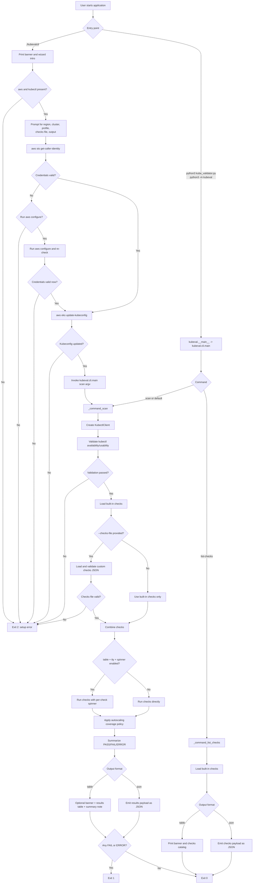
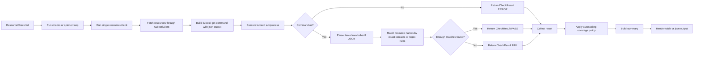

# kube-validator Flow Diagram

This diagram captures the two main user entry paths:

- `./kubevalctl`: interactive wizard for AWS/EKS setup plus scan
- `python3 kube_validator.py` or `python3 -m kubeval`: direct CLI scan/list flow

## Overall application flow

## Scan execution detail

