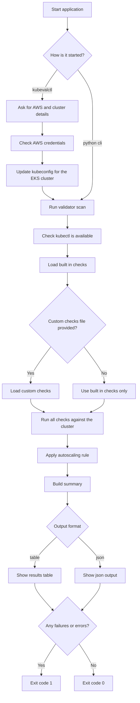
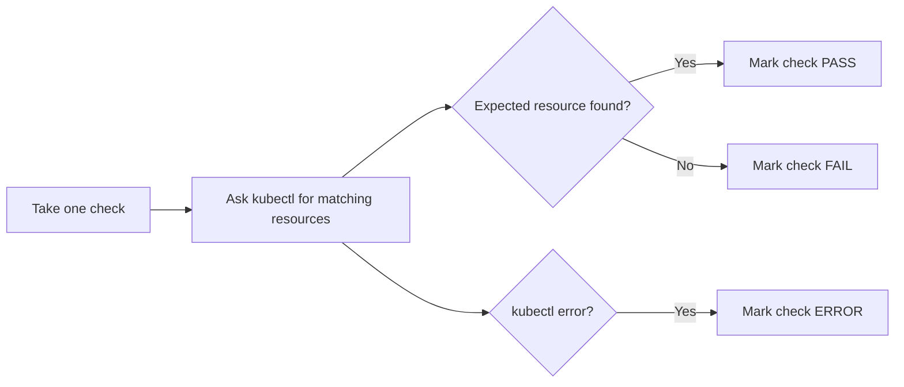

# kube-validator Flow Diagram

This is a simplified view of how the application runs.

## Main flow

```mermaid
flowchart TD
    A[Start application] --> B{How is it started?}

    B -->|kubevalctl| C[Ask for AWS and cluster details]
    C --> D[Check AWS credentials]
    D --> E[Update kubeconfig for the EKS cluster]
    E --> F[Run validator scan]

    B -->|python cli| F[Run validator scan]

    F --> G[Check kubectl is available]
    G --> H[Load built in checks]
    H --> I{Custom checks file provided?}
    I -->|Yes| J[Load custom checks]
    I -->|No| K[Use built in checks only]
    J --> L[Run all checks against the cluster]
    K --> L

    L --> M[Apply autoscaling rule]
    M --> N[Build summary]
    N --> O{Output format}
    O -->|table| P[Show results table]
    O -->|json| Q[Show json output]

    P --> R{Any failures or errors?}
    Q --> R
    R -->|Yes| S[Exit code 1]
    R -->|No| T[Exit code 0]
```

## What each check does

```mermaid
flowchart LR
    A[Take one check] --> B[Ask kubectl for matching resources]
    B --> C{Expected resource found?}
    C -->|Yes| D[Mark check PASS]
    C -->|No| E[Mark check FAIL]
    B --> F{kubectl error?}
    F -->|Yes| G[Mark check ERROR]
```
